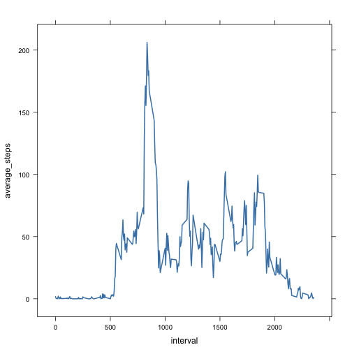
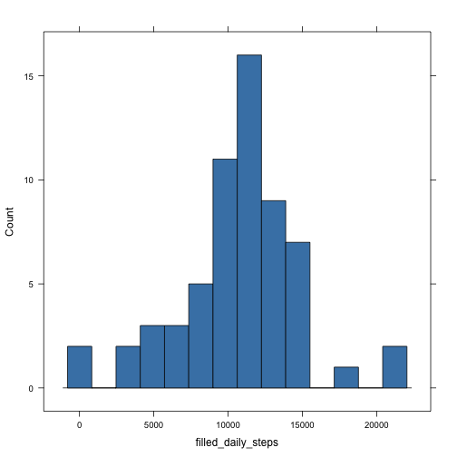
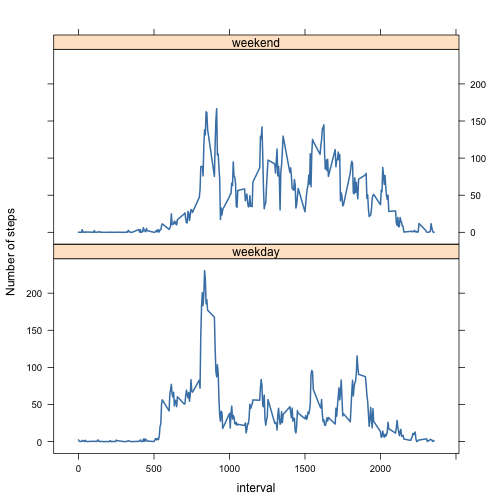

# Reproducible Research: Peer Assessment 1


## Loading and preprocessing the data

The data file is extracted from zip archive by unz() function, then it is loaded into a data frame by read.csv() function.


```r
data <- read.csv(unz('activity.zip', 'activity.csv'))
dim(data)
```

```
## [1] 17568     3
```

```r
head(data)
```

```
##   steps       date interval
## 1    NA 2012-10-01        0
## 2    NA 2012-10-01        5
## 3    NA 2012-10-01       10
## 4    NA 2012-10-01       15
## 5    NA 2012-10-01       20
## 6    NA 2012-10-01       25
```

Results of dim() and head() function indicate that the data is loaded as expected.

## What is mean total number of steps taken per day?

To address this question, total number of steps for each day is calculated at first. This is done by summing up steps, grouped by their dates. Histogram of daily total steps are plotted below.


```r
options(scipen=1);

# load library
library(ggplot2)
library(lattice)

# sum steps by date.
daily_steps <- tapply(data$steps, data$date, sum)

# then plot a histogram with 14 bins.
histogram(daily_steps, type="count", nint=14, col='steelblue')
```

 

Then, mean and median is calculated by corresponding functions.


```r
# calculat mean and median of total number of steps taken per day
mean_daily_steps <- mean(daily_steps, na.rm=T)
median_daily_steps <- median(daily_steps, na.rm=T)
```

Results are **10766.1887** and **10765**, respectively.

## What is the average daily activity pattern?

Following is a time series plot of the averaged number of steps of 5-minute interal.
The number of steps is averaged across all days.


```r
# calculate averaged steps of 5-minute interval, then turn it into a data frame.
average_steps <- tapply(data$steps, data$interval, mean, na.rm=T)
average_steps_df <- data.frame(interval=as.integer(names(average_steps)), average_steps=as.numeric(average_steps))

# make a time series plot of the averaged steps of 5-minute interval.
xyplot(average_steps ~ interval, data=average_steps_df, type='l', col='steelblue', lwd=2)
```

 


There is a high peak in the plot.


```r
max_case_no <- which.max(average_steps_df$average_steps)
max_case <- average_steps_df[max_case_no,]
```

Tha peak is at the interval **835**, and its value (maximun steps of averaged 5-minute interval) is **206.1698**.

## Imputing missing values

The number of missing value in the dataset can be caluclulated by the following code,


```r
total_na <- sum(is.na(data$steps))
```

and the result is **2304**. This is about **13.1%** of whole dataset.

To impute these missing values, tha averaged number of steps of 5-minute intervals that are calculeated in the section above is used:


```r
# join original data with averaged 5-minute data, then reorder the result.
filled_data <- merge(data, average_steps_df, by='interval')
filled_data <- filled_data[with(filled_data, order(date, interval)),]

# fill NA of steps by corresponding average_steps.
na_steps <- is.na(filled_data$steps)
filled_data$steps[na_steps] <- filled_data$average_steps[na_steps]

# drop unnecessary columns, and mimic the original row names.
filled_data <- filled_data[colnames(data)]
rownames(filled_data) <- rownames(data)
```

Then a histogram of the total number of steps taken each day is made. The following is the plot.


```r
# plot a histogram of the total number of steps per day.
filled_daily_steps <- tapply(filled_data$steps, filled_data$date, sum)
histogram(filled_daily_steps, type="count", nint=14, col='steelblue')
```

 

Also, mean and median of the filled data is calculated.
This time, na.rm is not needed.


```r
# calculat mean and median of total number of steps taken per day
filled_mean_daily_steps <- mean(filled_daily_steps)
filled_median_daily_steps <- median(filled_daily_steps)
```

Resulting mean and median of total (filled) number of steps per day is **10766.1887** is **10766.1887**, respectively.

They are almost identical to the original values.


## Are there differences in activity patterns between weekdays and weekends?

A new factor variable "daytype", which indicates whether the date is "weekday" or "weekend", is added by the code below:


```r
# set locale
lc <- Sys.setlocale(locale="en_US.UTF-8")

# function to convert datestring to daytype (e.g. "weekend", or "weekday")
date_to_daytype <- function(date_string, format="%Y-%m-%d") {
    weekday <- weekdays(strptime(date_string, format))
    if (weekday %in% c("Saturday", "Sunday")) "weekend" else "weekday"
}

# append new 'daytype' column
filled_data <- transform(filled_data,
                        daytype=factor(sapply(date, FUN=date_to_daytype, simplify=T, USE.NAMES=F)))
```

Then a panel plot with two time series plot is made. One plot shows the number of steps in weekends, another plot show the number of steps in weekdays.


```r
library(data.table)
# turn filled data into data.table, then calculate averaged steps of 5-minute interval,
# grouped by daytype.
filled_average_steps_dt <- data.table(filled_data)[, list(average_steps=mean(steps)), by=list(interval, daytype)]

# then, make a panel plot of the time series
xyplot(average_steps~interval | daytype, data=filled_average_steps_dt,
       type='l', col='steelblue', lwd=2,
       layout=c(1, 2), ylab='Number of steps')
```

 

It seems that there are differences in activity patterns between weekdays and weekends.
